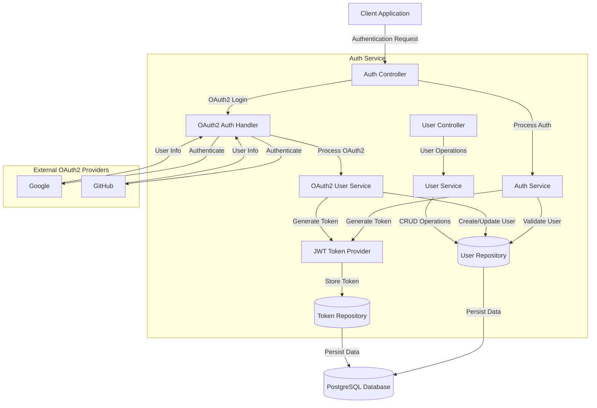

# Auth Service Architecture Diagram

The following diagram illustrates the high-level architecture of the Auth Service.

## Component Descriptions

### Client-Facing Components
- **Auth Controller**: Handles authentication requests, including login, registration, and token refresh
- **User Controller**: Manages user profile operations

### Core Services
- **Auth Service**: Implements authentication logic and user validation
- **OAuth2 Auth Handler**: Manages OAuth2 authentication flow with external providers
- **OAuth2 User Service**: Processes user information from OAuth2 providers
- **User Service**: Handles user-related operations
- **JWT Token Provider**: Generates and validates JWT tokens

### Data Access
- **User Repository**: Manages user entity persistence
- **Token Repository**: Manages token storage and validation

### External Integrations
- **OAuth2 Providers**: External authentication providers (Google, GitHub)

### Data Storage
- **PostgreSQL Database**: Persistent storage for user and token information